## Documentation for Project 4
## MEAN STACK DEPLOYMENT TO UBUNTU IN AWS

## STEP 1 — Install NodeJs

-- Starting by spinning up an EC2 instance server labelled 'Projec 4 - MEAN' from my CLI terminal in AWS

`sudo apt update`--(running command to update my list of packages in Ubuntu package manager)
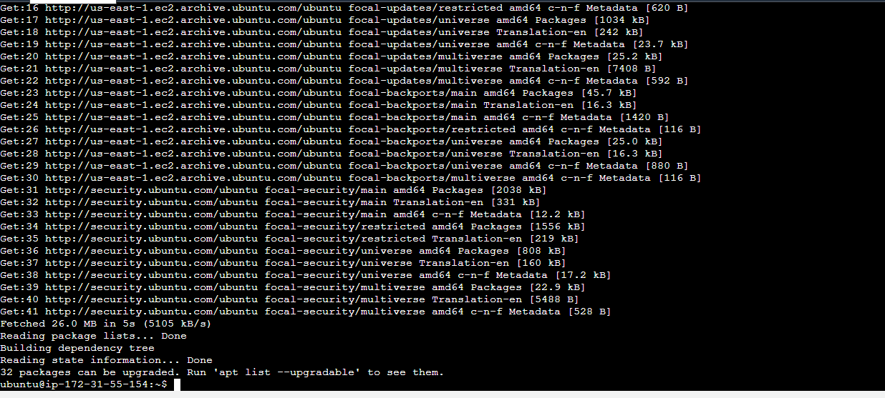

`sudo apt upgrade`--(running command to upgrade to lastest list of packages in Ubuntu package manager)
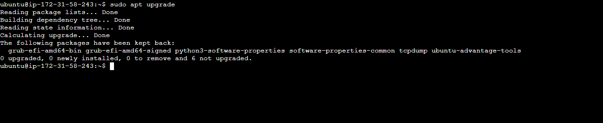

`sudo apt -y install curl dirmngr apt-transport-https lsb-release ca-certificates`--(Add certificates)
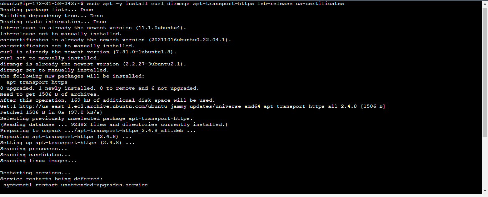

`curl -sL https://deb.nodesource.com/setup_12.x | sudo -E bash -` -(Add certificates)
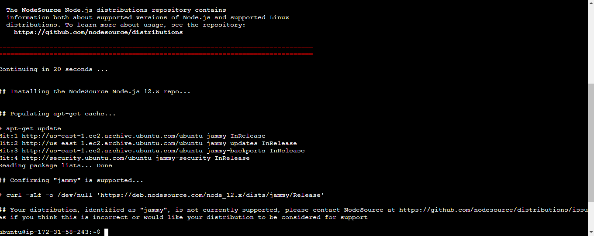 

`sudo apt install -y nodejs` -(Installing Node.js to make my system and broswer act as a server)
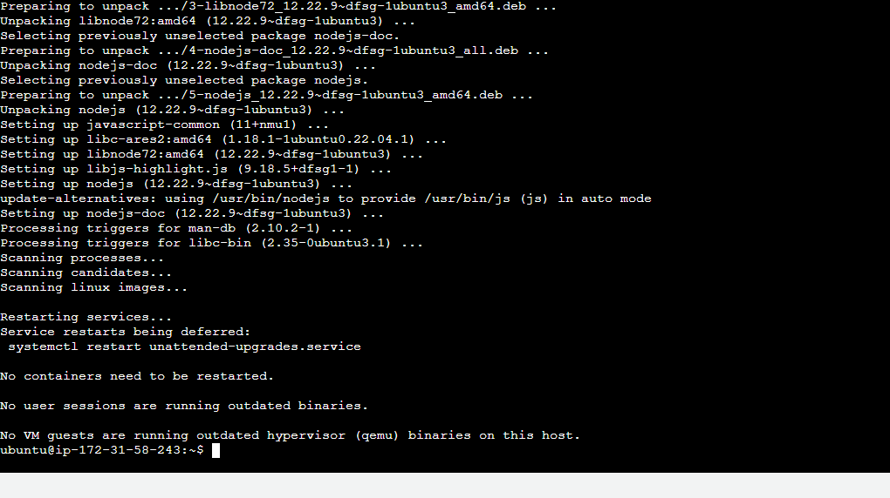

## STEP 2 — INSTALL MONGODB

`sudo apt-key adv --keyserver hkp://keyserver.ubuntu.com:80 --recv 0C49F3730359A14518585931BC711F9BA15703C6` ;`echo "deb [ arch=amd64 ] https://repo.mongodb.org/apt/ubuntu trusty/mongodb-org/3.4 multiverse" | sudo tee /etc/apt/sources.list.d/mongodb-org-3.4.list`--(adding book records to MongoDB that contain book name, isbn number, author, and number of pages.mages/WebConsole.gif)
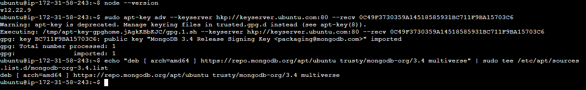

`sudo apt install -y mongodb` --(Installing mongodb database to store and retrieve data)
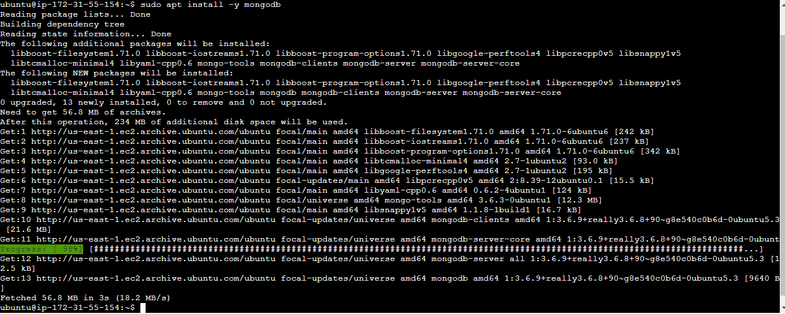

`sudo systemctl start mongodb` --(Start The server)
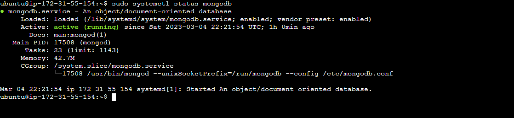

`sudo systemctl status mongodb` --(Verify that the service is up and running)

`sudo  npm install body-parser` --(Installing "body-parser" package to help process JSON files passed in requests to the server)

`mkdir Books && cd Books` ; `npm init`--(Create folder "Books" which is our project directory then initializing Books project)
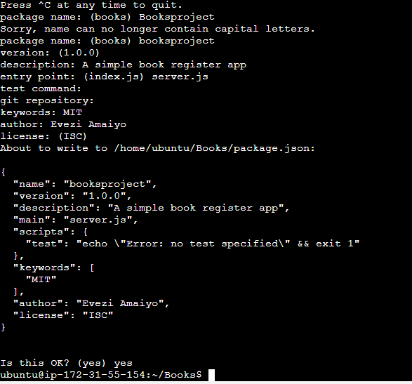

`vi server.js` --(Create folder "Books" which is our project directory then initializing Books project)
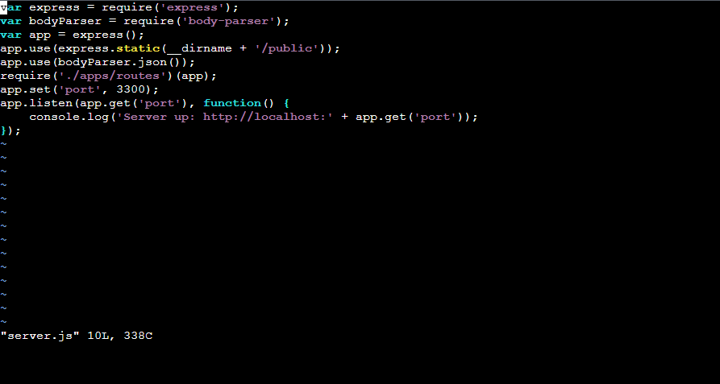

## STEP 3 — INSTALL EXPRESS AND SET UP ROUTES TO THE SERVER

`sudo npm install express mongoose`--(1. Install Express - Node framework and define routes for application base of http method and url. 2. Mongoose - use to model application data)
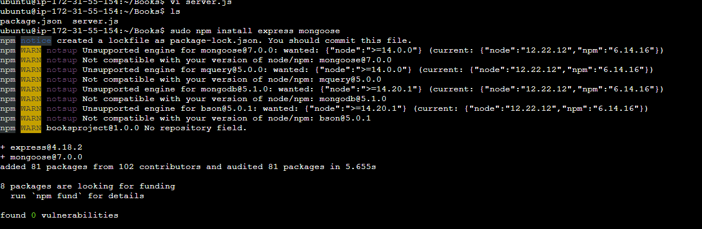

`mkdir apps && cd apps && touch routes.js`--(Create folder "apps" within Books project directory and create a file routes.js in the apps folder)

`vi routes.js`--(Open the routes.js file using vi text edior for linux environment, copy and paste snippet application code)
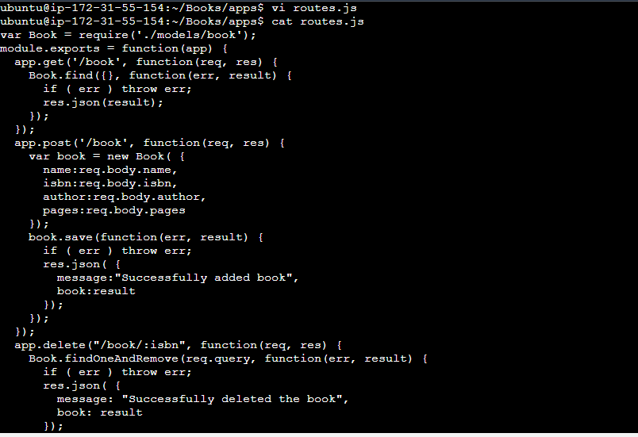

`mkdir models && cd models && touch book.js`--(Create folder "models" within Books project directory and create a file book.js in the models folder)
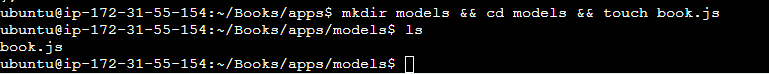

`vi book.js`--(Open the book.js file using vi text edior for linux environment, copy and paste snippet application code)
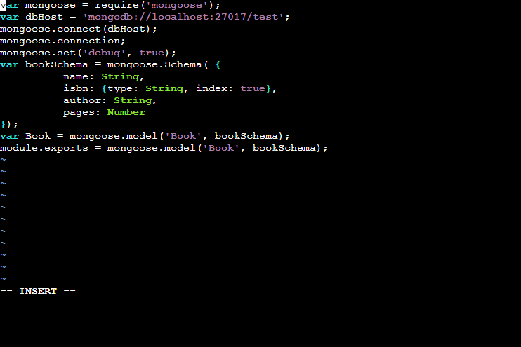

## STEP 4 – ACCESS THE ROUTE WITH ANGULARJS 

`mkdir public && cd public && touch script.js`--(Create folder "public" within Books project directory and create a file script.js in the public folder)
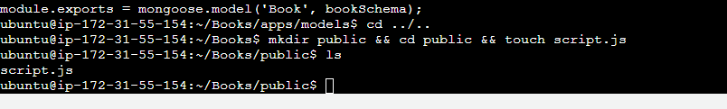

`vi script.js`--(Open the script.js file in public diretory using vi text edior for linux environment, copy and paste snippet application code)
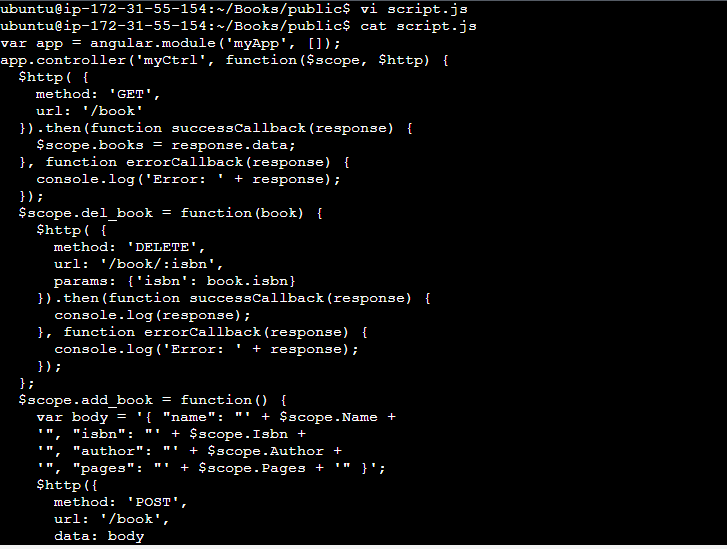

`vi imdex.html`--(Controller configuration defined. Open the script.js file in public diretory using vi text edior for linux environment, copy and paste snippet application code )
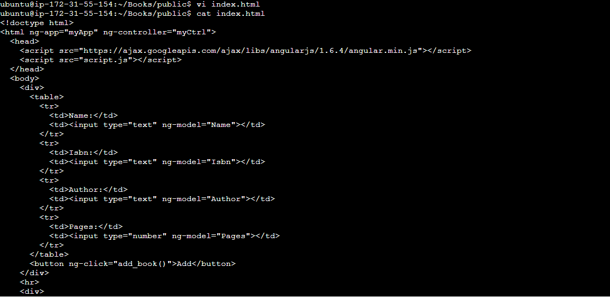

`node server.js`--(Start the server by running, confirmation server is runnning on TCP port 3300)
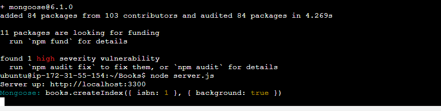

`node server.js`--(Start the server by running)

`http://100.26.224.20:3300`--(Access our Book Register web application from the Internet with a browser using Public IP address or Public DNS name. Post some entry which was stored in the database and retrieving entry list by hitting enter key on keyboard)
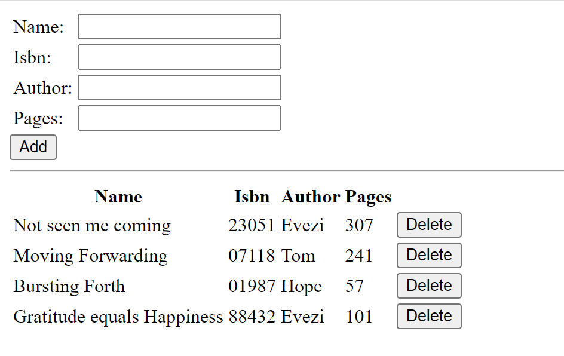

`curl -s http://169.254.169.254/latest/meta-data/public-ipv4`;`curl -s http://169.254.169.254/latest/meta-data/public-hostname` --(Retrieving my server Public IP address and Publid DNS name from my CLI terminal on aws.Testing how to retrieve files content in my meta-data directory.
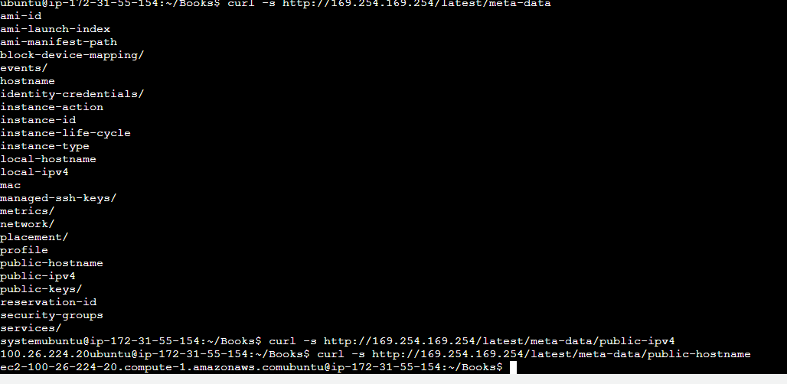